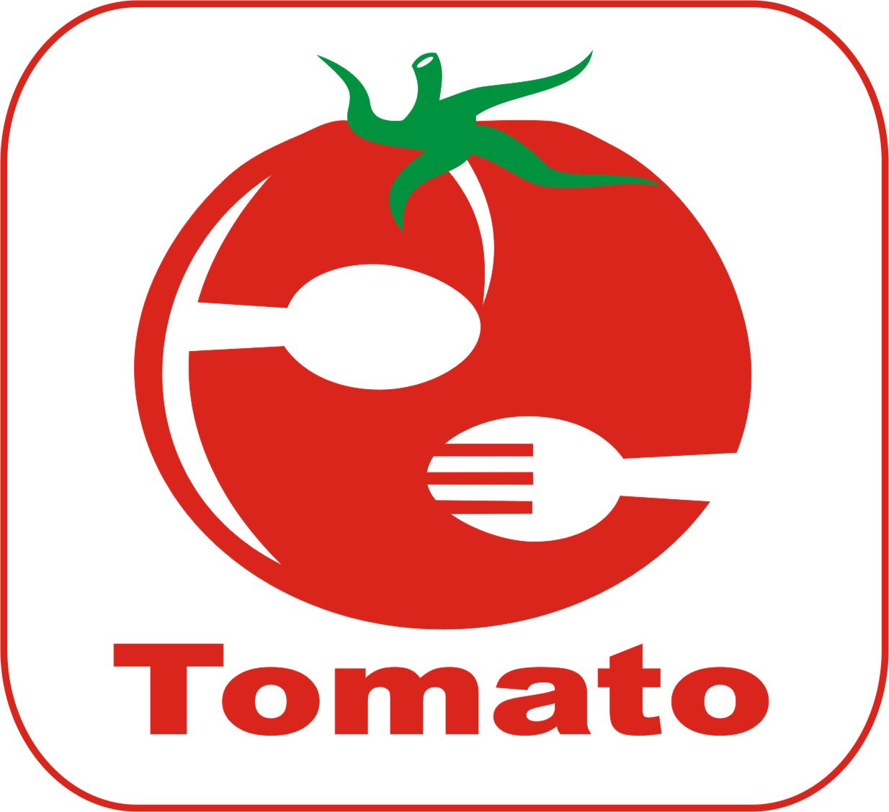
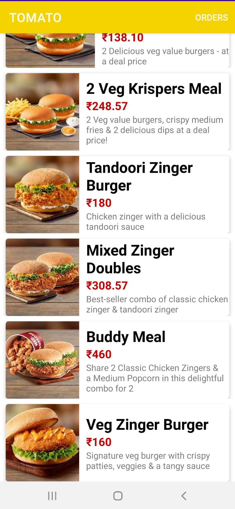
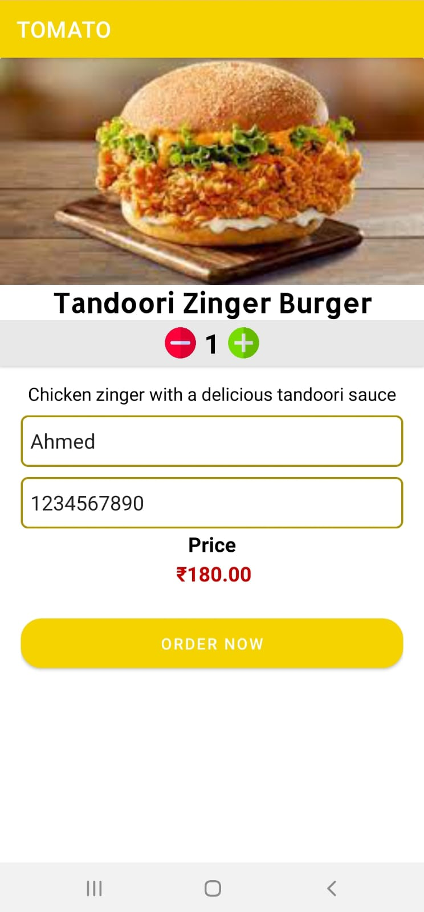
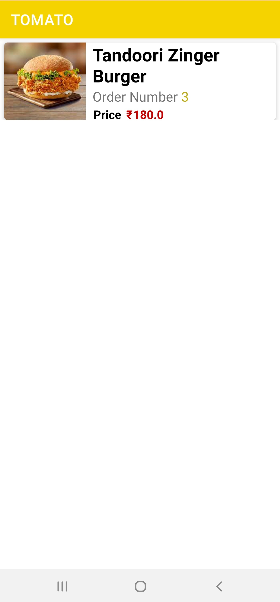

# TOMATO Food Ordering App

TOMATO FOOD ORDERING APPLICATION” is a Android-based application. The main objective of the Food Ordering Application is to manage the details of Food item, Order. It manages all the information about Food item and Customer. The purpose of the project is to built an application program to reduce the manual work for managing the Food item and Customer details. 
CONTENTS

<h1>LOGO</hi>

  

<h1>MENU</hi>

  

<h1>ORDER</hi>

  

<h1>ORDER DETAIL</hi>

  

